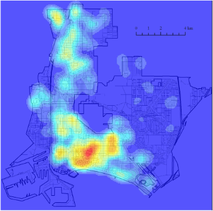
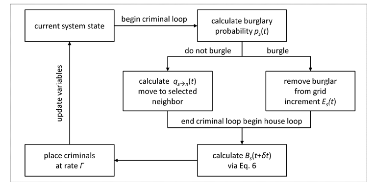
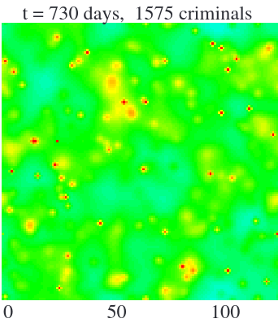
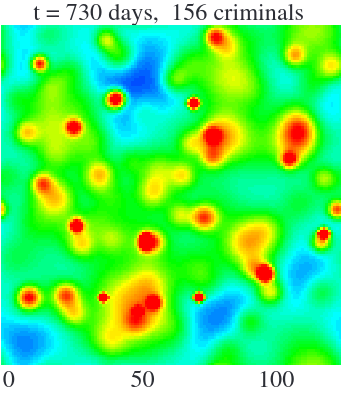
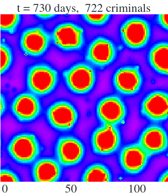

```{r xaringan-themer, include=FALSE, warning=FALSE}
#This block contains the theme configuration for the CSS lab slides style
library(xaringanthemer)
library(showtext)
style_mono_accent(
  base_color = "#5c5c5c",
  text_font_size = "1.5rem",
  header_font_google = google_font("Arial"),
  text_font_google   = google_font("Arial", "300", "300i"),
  code_font_google   = google_font("Fira Mono")
)
```

```{r setup, include=FALSE}
options(htmltools.dir.version = FALSE)
```

layout: true

<div class="my-footer"><span>Group 1 - Computational Modelling of Social Systems</span></div> 

---

# Overview

## 1. Introduction
## 2. Model
## 3. Different Outcomes
## 4. Resumee
## 5. Limitations
---
# Introduction: 'Burglary Model'

- Based on the paper [Short et. al. (2008): "A Statistical Model of Criminal Behavior" ](https://www.math.ucla.edu/~bertozzi/papers/M3AS-final.pdf)
- Emergence, dynamics, and steady-state properties of crime hotspots
- Empirical observation: spatio-temporal clusters of crime
  - **Spatial correlations**: high crime rate in certain areas
  - **Temporal correlations**: repeated targeting
- Question: what drives the emergence of different burglary patterns that result in 'crime hotspots'?

```{r, echo=FALSE, out.width=200, fig.align='center'}

```
.center[<small>Hotspots | Short et. al. (2008)</small>]

---
# Theoretical Background

- "Broken Windows Theory", [Wilson & Kelling (1982)](https://media4.manhattan-institute.org/pdf/_atlantic_monthly-broken_windows.pdf)
- Crime is more likely to occur in areas where it has already occurred
- A "broken window" lowers the threshold to break further windows
- Criticism: biased observations, focus on symptoms rather than causes & negligence of systematic discrimination/disintegration
```{r, echo=FALSE, out.width=400, fig.align='center'}

```
.center[<small>Scott Webb | www.pexels.com</small>]
---
# Model Assumptions: Agents
- 2 types of agents: Houses and Burglars
- The attractiveness of a **house** to be victimized is based on two assumptions:
  - Repeat and near-repeat victimization
  - "Broken Windows Theory"

$$A_s(t) = A_s^0 + B_s(t)$$
- **Burglars** decide at every step: break in vs. move on
- They tend to "walk" towards more attractive houses ("biased random walk")
---
# Model

- MultiGrid with size 50 x 50 (original 128 x 128)
-  Central Parameters
  - $\eta$ - Measures neighborhood effect [0 - 1]
  - $\theta$ - Dynamic increase of attractiveness
  - $\Gamma$ - Rate of burglar generation at each site

---
# Model Flowchart
```{r, echo=FALSE, out.width=950, fig.align='center'}

```
---
# Different Outcomes
## 1. Spatial homogeneity
## 2. Dynamic hotspots
## 3. Stationary hotspots
---

# 1. Spatial homogenity


.pull-left[
```{r, echo=FALSE, out.width=350, fig.align='center'}

```
]
.pull-right[
```{r, echo=FALSE, out.width=350, fig.align='center'}
knitr::include_graphics("https://cloud.uni-graz.at/s/cy6YcGyg5xC4xmr/download/spatial.gif")
```
]
.center[
Parameters: $\eta$ = 0.2, $\theta$ = 0.56 and $\Gamma$ = 0.019
]
---

# 2. Dynamic hotspots

.pull-left[
```{r, echo=FALSE, out.width=350, fig.align='center'}

```
]
.pull-right[
```{r, echo=FALSE, out.width=350, fig.align='center'}
knitr::include_graphics("https://cloud.uni-graz.at/s/PK3ijSQMnpe8328/download/dynamic.gif")
```
]
.center[
Parameters: $\eta$ = 0.2, $\theta$ = 5.6 and $\Gamma$ = 0.002
]
---

# 3. Stationary hotspots

.pull-left[
```{r, echo=FALSE, out.width=350, fig.align='center'}

```
]
.pull-right[
```{r, echo=FALSE, out.width=350, fig.align='center'}
knitr::include_graphics("https://cloud.uni-graz.at/s/xnMi7N7PxAGDXLc/download/stationary.gif")
```
]
.center[
Parameters: $\eta$ = 0.03, $\theta$ = 0.56 and $\Gamma$ = 0.019
]
---
# Resumee

- Model generates nonlinear feedback loops which originate patterns of aggregation
- Qualitative similarity to empirical observations of 'crime hotspots'
  - Better understanding of why and how hotspots form
  - Better understanding of underlying dynamics


---
# Limitations

- Negligence of barriers/hindrances
  - No presence of police forces
  - No security/surveillance infrastructure
- Spatially uniform value for static attractiveness
  - Would an expensive property be more or less attractive?
- Spatially uniform density of houses
- All burglars behave in the same manner
  - Different kinds of burglars in reality?
---
.center[
# Thank you for your attention
]